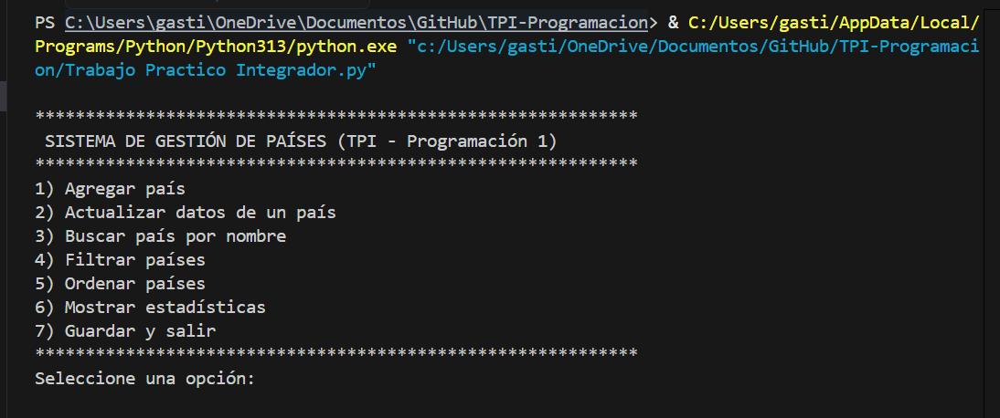
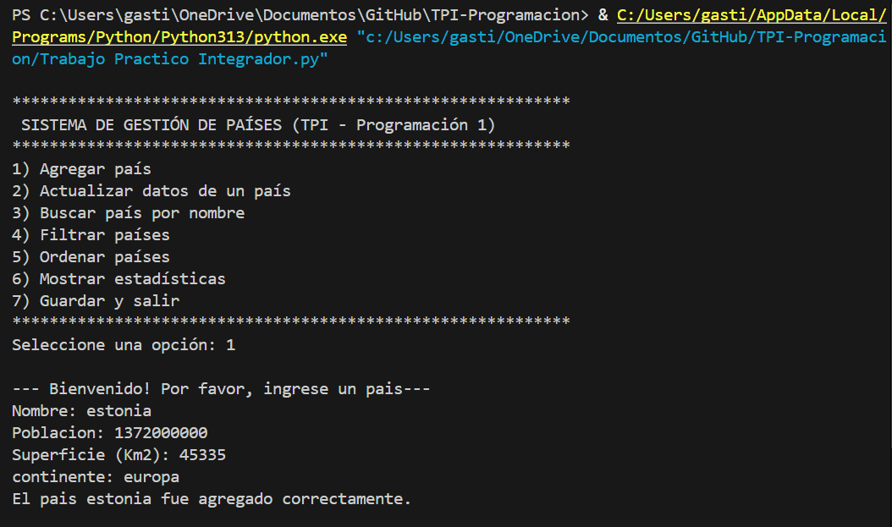
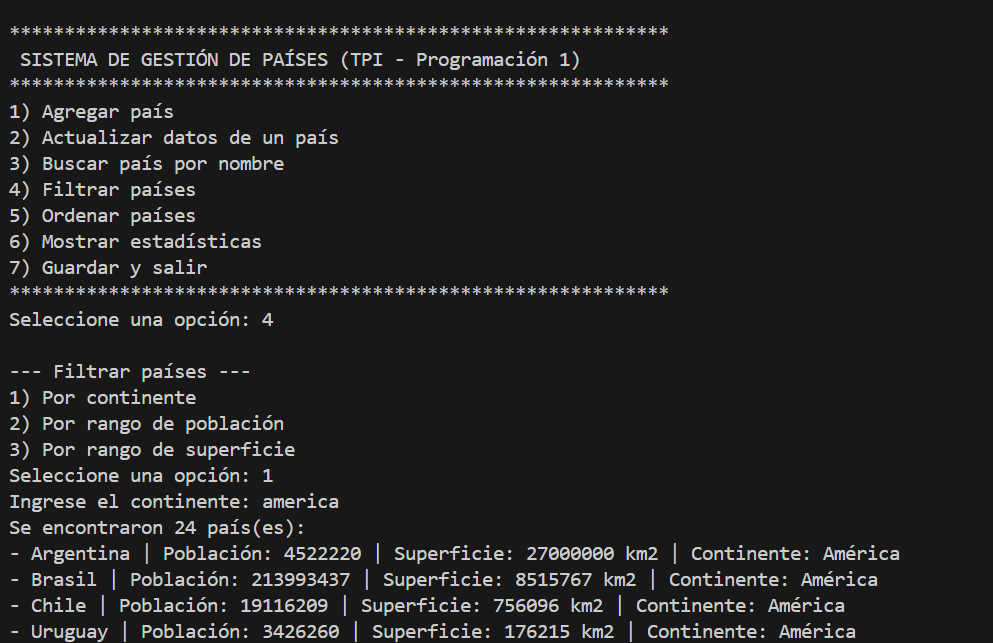
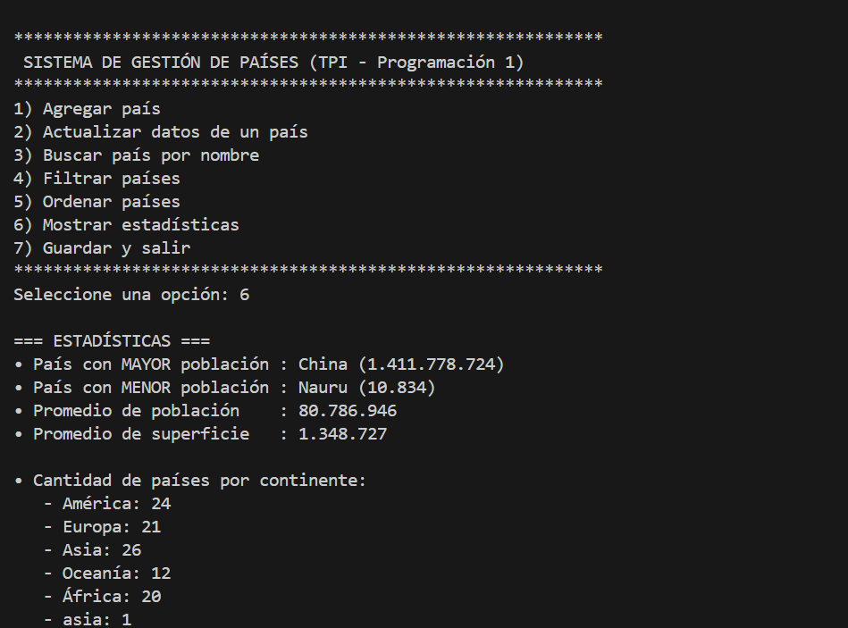

# 🗺️ Sistema de Gestión de Países  
**Trabajo Práctico Integrador – Programación I (UTN)**  
Autores: **Gastón Crespo** y **Oriana Cortés**  
Año: 2025  
Lenguaje: **Python 3**

---

## 🧠 Descripción del proyecto  

El **Sistema de Gestión de Países** es una aplicación de consola desarrollada en **Python** que permite **administrar, consultar y analizar información de países** almacenada en un archivo CSV.  

A través de un menú interactivo, el usuario puede agregar, buscar, filtrar, ordenar y actualizar países, además de obtener estadísticas como promedios, máximos y mínimos de población y superficie, y la cantidad de países por continente.  

El proyecto integra los conceptos vistos en la materia **Programación I**, aplicando estructuras de datos (listas y diccionarios), manejo de archivos, validaciones de entrada, modularización y persistencia de datos.

---

## ⚙️ Cómo ejecutar el programa  

### 🧩 Requisitos  
- **Python 3.10 o superior** (debido al uso de `match case`).  
- Archivo `paises.csv` en la misma carpeta que el programa principal.  
  > Si no existe, el sistema lo creará automáticamente.

---

### ▶️ Opción 1 — Ejecución directa  

1. Descargar o copiar el proyecto en una carpeta local.  
2. Abrir una terminal o consola en esa carpeta.  
3. Ejecutar el siguiente comando:  

```bash
python "Trabajo Practico Integrador.py"
```
Si tu instalación de Python requiere la ruta completa, podés usar (ajustando según tu PC):
```bash
C:/Users/gasti/AppData/Local/Programs/Python/Python313/python.exe "c:/Users/gasti/OneDrive/Documentos/GitHub/TPI-Programacion/Trabajo Practico Integrador.py" 
```
El programa cargará los datos del archivo CSV (o creará uno nuevo) y mostrará el menú principal.

---

### 💻 Opción 2 — Ejecución desde GitHub  

1. Clonar el repositorio con:
```bash
git clone https://github.com/Gaston-Crespo/TPI-Programacion.git
cd TPI-Programacion
```
2. Ejecutar
```bash
python "Trabajo Practico Integrador.py"
```

---

### ⚠️ Versión de Python

El programa utiliza la estructura match case, disponible a partir de Python 3.10.
Si usás una versión anterior (3.8 o 3.9), mostrará errores de sintaxis.
Se recomienda ejecutar con Python 3.10, o superior.

--- 

🖼️ Ejemplos (inputs/outputs)

A continuación se mostrarán capturas de pantalla de la ejecución real del programa:

### 🧾 Menú principal


### ➕ Agregar un país


### 🔍 Filtrar países por continente


### 📈 Estadísticas generales


---

🤝 Colaboradores

Gastón Crespo

Oriana Cortés 

---

## 🎬 Video de presentación del proyecto  

Presentamos el funcionamiento del sistema, sus módulos principales y las pruebas de ejecución:  
[▶️ Ver en YouTube](https://youtu.be/-J2wlkejRMU)

---

## 📄 Informe del Proyecto (PDF)

Podés ver o descargar el informe completo desde el siguiente enlace:  

[📥 Ver Informe (abrir en navegador)](https://github.com/Gaston-Crespo/TPI-Programacion/raw/main/pdf/TPI_Programacion_Gestion_de_paises.pdf)

El documento incluye:
- Introducción, objetivos y marco teórico  
- Diseño previo y diagrama de flujo  
- Desarrollo detallado y resultados  
- Conclusiones, bibliografía y anexos (incluyendo el video del proyecto)